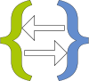

#  Stylus/Less/Sass/Scss to CSS  Compiler

### [css.pabli.dev](https://css.pabli.dev/)

Dependecies
---
- Editor: [Ace Editor](https://github.com/ajaxorg/ace)
- Preprocessors: [Stylus](https://github.com/openstyles/stylus-lang-bundle), [Less](https://github.com/less/less.js), [Sass](https://github.com/sass/dart-sass)
- Icons: [Remix Icon](https://remixicon.com/)

Dev
---
```bash
npm run dev
```
Build
---
```bash
npm run build
```